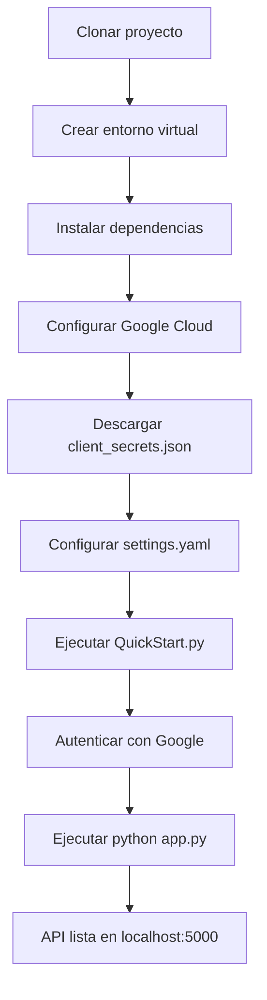

# 🚀 Google Drive Permissions Manager API


Una API RESTful construida con Flask para gestionar permisos de archivos en Google Drive de manera programática. Perfecta para automatizar la administración de accesos y permisos en tu Google Drive.

## 📋 Características Principales

- ✅ **Gestión completa de permisos** - Listar, otorgar y eliminar permisos
- ✅ **API RESTful** - Endpoints claros y documentados
- ✅ **Autenticación OAuth 2.0** - Segura y confiable
- ✅ **Estructura modular** - Separación de responsabilidades
- ✅ **CORS configurado** - Listo para integración frontend
- ✅ **Logging detallado** - Facilita debugging y monitoreo

## 🏗️ Arquitectura del Proyecto

```
google-drive-manager/
├── app.py                    # Punto de entrada principal
├── requirements.txt          # Dependencias de Python
├── settings.yaml            # Configuración de Google OAuth
├── .env                     # Variables de entorno
├── client_secrets.json      # Credenciales de Google Cloud
├── credentials_module.json  # Tokens de acceso (generado)
│# 🚀 Google Drive Permissions Manager API


Una API RESTful construida con Flask para gestionar permisos de archivos en Google Drive de manera programática. Perfecta para automatizar la administración de accesos y permisos en tu Google Drive.

## 📋 Características Principales

- ✅ **Gestión completa de permisos** - Listar, otorgar y eliminar permisos
- ✅ **API RESTful** - Endpoints claros y documentados
- ✅ **Autenticación OAuth 2.0** - Segura y confiable
- ✅ **Estructura modular** - Separación de responsabilidades
- ✅ **CORS configurado** - Listo para integración frontend
- ✅ **Logging detallado** - Facilita debugging y monitoreo

## 🏗️ Arquitectura del Proyecto

```
google-drive-manager/
├── app.py                    # Punto de entrada principal
├── requirements.txt          # Dependencias de Python
├── settings.yaml            # Configuración de Google OAuth
├── .env                     # Variables de entorno
├── client_secrets.json      # Credenciales de Google Cloud
├── credentials_module.json  # Tokens de acceso (generado)
│
├── src/                     # Código fuente modular
│   ├── routes/             # Blueprints de rutas
│   ├── services/           # Lógica de negocio
│   └── utils/              # Utilidades compartidas
│
├── static/                  # Archivos estáticos
│   └── css/
│
├── templates/               # Templates HTML
│   └── index.html
│
└── QuickStart.py           # Script de configuración inicial
```

## 🚀 Instalación Rápida

### Prerrequisitos

- Python 3.8 o superior
- Cuenta de Google con Google Drive habilitado
- Acceso a Google Cloud Console

### Paso 1: Clonar el repositorio

```bash
git clone https://github.com/J-o-s-eandres/GoogleDriveApi.git
cd google-drive-manager
```

### Paso 2: Crear y activar entorno virtual

```bash
# Windows
python -m venv venv
venv\Scripts\activate

# Linux/Mac
python3 -m venv venv
source venv/bin/activate
```

### Paso 3: Instalar dependencias

```bash
pip install -r requirements.txt
```

### Paso 4: Configurar Google Cloud Console

1. **Accede a** [Google Cloud Console](https://console.cloud.google.com/)
2. **Crea un nuevo proyecto** o selecciona uno existente
3. **Habilita Google Drive API**:
   - Ve a "APIs y servicios" → "Biblioteca"
   - Busca "Google Drive API"
   - Haz clic en "Habilitar"
4. **Configura pantalla de consentimiento OAuth**:
   - Ve a "APIs y servicios" → "Pantalla de consentimiento OAuth"
   - Selecciona "Externo" → "Crear"
   - Completa la información requerida
   - Agrega el scope: `https://www.googleapis.com/auth/drive`
   - Agrega usuarios de prueba (opcional para desarrollo)

### Paso 5: Descargar credenciales

1. **Ve a** "APIs y servicios" → "Credenciales"
2. **Haz clic en** "Crear credenciales" → "ID de cliente OAuth"
3. **Selecciona** "Aplicación de escritorio"
4. **Haz clic en** "Descargar JSON"
5. **Renombra el archivo** a `client_secrets.json`
6. **Mueve el archivo** a la raíz del proyecto

### Paso 6: Configurar settings.yaml

1. **Abre** `client_secrets.json` en un editor de texto
2. **Busca** `client_id` y `client_secret`
3. **Edita** `settings.yaml` con estos valores:

```yaml
client_config_backend: settings
client_config:
  client_id: TU_CLIENT_ID_AQUI
  client_secret: TU_CLIENT_SECRET_AQUI

save_credentials: True
save_credentials_backend: file
save_credentials_file: credentials_module.json

get_refresh_token: True

oauth_scope:
  - https://www.googleapis.com/auth/drive
  - https://www.googleapis.com/auth/drive.file
```

### Paso 7: Ejecutar configuración inicial

```bash
python QuickStart.py
```

Este script abrirá tu navegador para autenticarte con Google. Acepta los permisos solicitados.

### Paso 8: Iniciar la aplicación

```bash
python app.py
```

La API estará disponible en: **http://localhost:5000**

## 📡 Endpoints de la API

### 🔍 Métodos GET

| Endpoint | Descripción | Parámetros |
|----------|-------------|------------|
| `GET /` | Página principal de la API | Ninguno |
| `GET /api/status` | Estado del servicio y credenciales | Ninguno |
| `GET /api/test` | Prueba de funcionamiento de la API | Ninguno |
| `GET /api/permissions/{file_id}` | Listar permisos de un archivo | `file_id` |
| `GET /api/file/{file_id}` | Obtener información de un archivo | `file_id` |

### ➕ Métodos POST

| Endpoint | Descripción | Body (JSON) |
|----------|-------------|-------------|
| `POST /api/permissions` | Otorgar un nuevo permiso | Ver ejemplo abajo |

**Ejemplo Body:**
```json
{
  "file_id": "1abcDEFgHijKlMnOpQRstUVwxyZ123456789",
  "type": "user",
  "value": "usuario@ejemplo.com",
  "role": "writer"
}
```

### ❌ Métodos DELETE

| Endpoint | Descripción | Parámetros/Body |
|----------|-------------|-----------------|
| `DELETE /api/permissions/{file_id}` | Eliminar permiso por ID o email | Body: `{"permission_id": "xxx"}` o `{"email": "xxx"}` |
| `DELETE /api/permissions/{file_id}/email` | Eliminar permiso por email específico | Body: `{"email": "xxx"}` |
| `DELETE /api/permissions/{file_id}/{permission_id}` | Eliminar permiso por ID directo | Parámetro URL: `permission_id` |

## 🛠️ Uso con cURL

### Listar permisos de un archivo
```bash
curl -X GET "http://localhost:5000/api/permissions/1abcDEFgHijKlMnOpQRstUVwxyZ123456789"
```

### Otorgar permiso de escritura
```bash
curl -X POST "http://localhost:5000/api/permissions" \
  -H "Content-Type: application/json" \
  -d '{
    "file_id": "1abcDEFgHijKlMnOpQRstUVwxyZ123456789",
    "type": "user",
    "value": "colaborador@ejemplo.com",
    "role": "writer"
  }'
```

### Eliminar permiso por email
```bash
curl -X DELETE "http://localhost:5000/api/permissions/1abcDEFgHijKlMnOpQRstUVwxyZ123456789/email" \
  -H "Content-Type: application/json" \
  -d '{"email": "colaborador@ejemplo.com"}'
```

## 🔧 Configuración Avanzada

### Variables de Entorno
Crea un archivo `.env` en la raíz:

```env
SECRET_KEY=tu_clave_secreta_aqui
FLASK_ENV=development
FLASK_DEBUG=True
```

### Tipos de Permisos Disponibles
- **`type`**: `user`, `group`, `domain`, `anyone`
- **`role`**: `reader`, `writer`, `commenter`, `owner`

### Ejemplo de settings.yaml completo
```yaml
client_config_backend: settings
client_config:
  client_id: TU_CLIENT_ID
  client_secret: TU_CLIENT_SECRET

save_credentials: True
save_credentials_backend: file
save_credentials_file: credentials_module.json

get_refresh_token: True
access_type: offline
approval_prompt: force

oauth_scope:
  - https://www.googleapis.com/auth/drive
  - https://www.googleapis.com/auth/drive.file
  - https://www.googleapis.com/auth/drive.metadata

http_timeout: 300
```

## 🐛 Solución de Problemas

### Error: "Invalid credentials"
```bash
# Elimina las credenciales y reconecta
rm credentials_module.json
python QuickStart.py
```

### Error: "redirect_uri_mismatch"
1. Ve a Google Cloud Console → Credenciales
2. En "URIs de redireccionamiento autorizados" agrega:
   - `http://localhost:8080/`
   - `http://localhost:5000/`

### Error: "insufficient authentication scopes"
```bash
# Elimina credenciales y ejecuta QuickStart.py
rm credentials_module.json
python QuickStart.py
```

### El servidor no inicia
```bash
# Verifica que el puerto 5000 esté libre
netstat -ano | findstr :5000  # Windows
lsof -i :5000                 # Linux/Mac
```

## 📊 Ejemplo de Respuestas de la API

### ✅ Éxito al listar permisos
```json
{
  "success": true,
  "file_id": "1abcDEFgHijKlMnOpQRstUVwxyZ123456789",
  "file_title": "Documento Importante.docx",
  "permissions": [
    {
      "id": "permission123",
      "type": "user",
      "role": "owner",
      "email": "propietario@ejemplo.com",
      "name": "Juan Pérez"
    }
  ],
  "count": 1
}
```

### ✅ Éxito al otorgar permiso
```json
{
  "success": true,
  "message": "Permiso otorgado exitosamente",
  "permission_id": "permission456",
  "type": "user",
  "value": "colaborador@ejemplo.com",
  "role": "writer"
}
```

### ❌ Error común
```json
{
  "error": "Error obteniendo permisos: File not found: 1abcDEF",
  "success": false
}
```

## 🧪 Testing

### Pruebas manuales
```bash
# Verificar estado del servicio
curl http://localhost:5000/api/status

# Probar endpoint de prueba
curl http://localhost:5000/api/test
```

## 📈 Monitoreo

La API incluye endpoints para monitoreo:

- **`/api/status`**: Verifica credenciales y estado
- **Logs en consola**: Información detallada de cada operación

## 🔒 Seguridad

- **Tokens OAuth 2.0**: Autenticación segura con Google
- **Refresh tokens**: Acceso continuo sin reautenticación
- **CORS configurado**: Restricción de orígenes permitidos
- **Variables de entorno**: Configuración sensible externalizada

## 🤝 Contribuir

1. Haz fork del proyecto
2. Crea una rama (`git checkout -b feature/AmazingFeature`)
3. Commit tus cambios (`git commit -m 'Add AmazingFeature'`)
4. Push a la rama (`git push origin feature/AmazingFeature`)
5. Abre un Pull Request

## 📄 Licencia

Distribuido bajo la licencia MIT. Ver `LICENSE` para más información.

## ✨ Créditos

- **Desarrollado por** - [Tu Nombre/Equipo]
- **Framework** - Flask
- **API de Google Drive** - PyDrive2
- **Estructura modular** - Patrón de servicios y blueprints

## 📞 Soporte

Para soporte, abre un issue en el repositorio o contacta a [tu-email@ejemplo.com](mailto:tu-email@ejemplo.com)

---

<div align="center">
  
**¿Listo para gestionar tus permisos de Google Drive?** 🚀

[]()

*Si encuentras útil este proyecto, considera darle una ⭐ en GitHub!*

</div>

## 🔄 Flujo de Trabajo Típico



